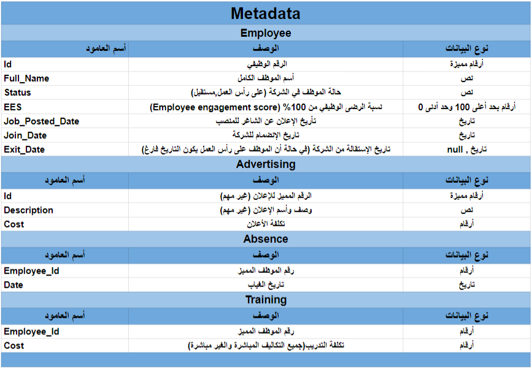

# نموذج مؤشرات أداة لقسم الموارد البشرية

> **Note**
> لمشاهدة النتيجة النهائية قم بالزيارة هنا
> * Tableau  [نموذج مؤشرات أداة لقسم الموارد البشرية 2023](https://public.tableau.com/views/2023_16991213214090/2023?:language=en-US&:display_count=n&:origin=viz_share_link)

## الأهداف 

  **تحديد مؤشرات أداة لقسم الموارد البشرية لعام 2023**
  

1. **عدد الموظفين** \/ + [x] [Google Sheet](https://github.com/alsobihi/HR-KPI/blob/main/kpi/عدد_الموظفين.md#google-sheet)
1.  **عدد استقالات الموظفين**
1. **عدد الموظفين الحاليين**
1. **معدل دوران الموظفين**
1.  **معدل وقت التوظيف**
1.  **تكلفة التوظيف** 
1. **معدل الغياب**
1. **تكاليف التدريب**
1. **معدل الرضا الوظيفي**

## الخطوة الأولى  😎
تحديد البيانات المرتبطة بمؤشرات الأداة :bar_chart:

+  [x] **بيانات الموظفين** [أضغط هنا للتحميل](data/HR-KPI_Employee.csv)
+  [x] **بيانات غياب الموظفين** [أضغط هنا للتحميل](data/HR-KPI_Absence.csv)
+  [x] **بيانات تكاليف التدريب** [أضغط هنا للتحميل](data/HR-KPI_Training.csv)
+  [x] **بيانات تكاليف إعلانات الوظائف** [أضغط هنا للتحميل](data/HR-KPI_Advertising.csv)

هنا موجز لشرح جميع البيانات والأعمدة 

[MetaData](https://docs.google.com/spreadsheets/d/10PCT9hpFjGG23YWSh-tIuiqYqdaWoGqrRjr1AHKnGdM/edit?usp=sharing)

###  المؤشر الأول: عدد الموظفين [عدد_الموظفين.md](kpi/عدد_الموظفين.md)
- [x] [Google Sheet](https://github.com/alsobihi/HR-KPI/blob/main/kpi/عدد_الموظفين.md#google-sheet)
- [x] [BigQuery](https://github.com/alsobihi/HR-KPI/blob/main/kpi/عدد_الموظفين.md#bigquery)
- [x] [Tableau](https://github.com/alsobihi/HR-KPI/blob/main/kpi/عدد_الموظفين.md#tableau)
- [x] [R](https://github.com/alsobihi/HR-KPI/blob/main/kpi/عدد_الموظفين.md#r)
- [x] [Python](https://github.com/alsobihi/HR-KPI/blob/main/kpi/عدد_الموظفين.md#python)

### المؤشر الثاني: عدد الاستقالات [عدد_الاستقالات.md](kpi/عدد_الاستقالات.md)
- [x] [Google Sheet](kpi/عدد_الاستقالات.md#google-sheet)
- [x] [BigQuery](kpi/عدد_الاستقالات.md#bigquery)
- [x] [Tableau](kpi/عدد_الاستقالات.md#tableau)
- [x] [R](kpi/عدد_الاستقالات.md#r)
- [x] [Python](kpi/عدد_الاستقالات.md#python)

### المؤشر الثالث: عدد الموظفين الحاليين [عدد_الموظفين_الحاليين.md](kpi/عدد_الموظفين_الحاليين.md)
- [x] [Google Sheet](kpi/عدد_الموظفين_الحاليين.md#google-sheet)
- [x] [BigQuery](kpi/عدد_الموظفين_الحاليين.md#bigquery)
- [x] [Tableau](kpi/عدد_الموظفين_الحاليين.md#tableau)
- [x] [R](kpi/عدد_الموظفين_الحاليين.md#r)
- [x] [Python](kpi/عدد_الموظفين_الحاليين.md#python)

### المؤشر السادس: تكلفة التوظيف [تكلفة_التوظيف.md](kpi/تكلفة_التوظيف.md)
- [x] [Google Sheet](kpi/تكلفة_التوظيف.md#google-sheet)
- [x] [BigQuery](kpi/تكلفة_التوظيف.md#bigquery)
- [x] [Tableau](kpi/تكلفة_التوظيف.md#tableau)
- [x] [R](kpi/تكلفة_التوظيف.md#r)
- [x] [Python](kpi/تكلفة_التوظيف.md#python)

### المؤشر الرابع: معدل دوران الموظفين [معدل_دوران_الموظفين.md](kpi/معدل_دوران_الموظفين.md)
- [x] [Google Sheet](kpi/معدل_دوران_الموظفين.md#google-sheet)
- [ ] [BigQuery](#bigquery)
- [ ] [Tableau](#tableau)
- [ ] [R](#r)
- [ ] [Python](#python)

### المؤشر الخامس: معدل وقت التوظيف [معدل_وقت_التوظيف.md](kpi/معدل_وقت_التوظيف.md)
- [x] [Google Sheet](kpi/معدل_وقت_التوظيف.md#google-sheet)
- [x] [BigQuery](kpi/معدل_وقت_التوظيف.md#bigquery)
- [x] [Tableau](kpi/معدل_وقت_التوظيف.md#tableau)
- [ ] [R](#r)
- [x] [Python](kpi/معدل_وقت_التوظيف.md#python)

### المؤشر السابع: معدل الغياب [معدل_الغياب.md](kpi/معدل_الغياب.md)
- [x] [Google Sheet](kpi/معدل_الغياب.md#google-sheet)
- [x] [BigQuery](kpi/معدل_الغياب.md#bigquery)
- [x] [Tableau](kpi/معدل_الغياب.md#tableau)
- [x] [R](kpi/معدل_الغياب.md#r)
- [x] [Python](kpi/معدل_الغياب.md#python)

### المؤشر الثامن:  تكلفة التدريب [تكلفة_التدريب.md](kpi/تكلفة_التدريب.md)
- [x] [Google Sheet](kpi/تكلفة_التدريب.md#google-sheet)
- [x] [BigQuery](kpi/تكلفة_التدريب.md#bigquery)
- [x] [Tableau](kpi/تكلفة_التدريب.md#tableau)
- [ ] [R](#r)
- [x] [Python](kpi/تكلفة_التدريب.md#python)

### المؤشر التاسع: معدل الرضا الوظيفي [معدل_الرضا_الوظيفي.md](kpi/معدل_الرضا_الوظيفي.md)
- [x] [Google Sheet](kpi/معدل_الرضا_الوظيفي.md#google-sheet)
- [x] [BigQuery](kpi/معدل_الرضا_الوظيفي.md#bigquery)
- [x] [Tableau](kpi/معدل_الرضا_الوظيفي.md#tableau)
- [x] [R](kpi/معدل_الرضا_الوظيفي.md#r)
- [x] [Python](kpi/معدل_الرضا_الوظيفي.md#python)

